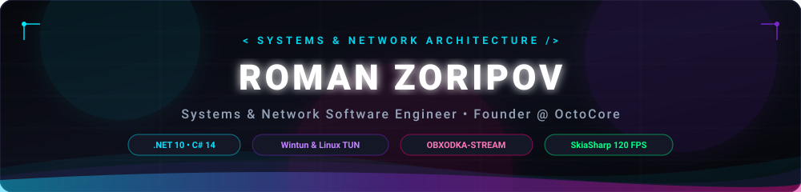
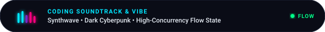

<p align="center">
  
</p>

<p align="center">
  <a href="https://github.com/OctoCore-Dev/obxodka">
    
  </a>
</p>

<div align="center">

[](https://obxodka.one)
[](https://github.com/OctoCore-Dev)
[](https://play.google.com/store/apps/details?id=com.octocore.obxodka)
[](https://apps.microsoft.com/store/detail/9NZXP5WR803J)
[](https://t.me/octo_core)
[](mailto:contact@octocore.dev)

</div>

<br/>

<p align="center">
  
</p>

```bash
╭─────────────────────────────────────────────────────────────────────────────╮
│ 🔴 🟡 🟢  irovbyte@quantum-node:~$ neofetch --profile                       │
├─────────────────────────────────────────────────────────────────────────────┤
│  OS: Arch Linux x86_64 / Windows 11 Pro [Hyper-V Subsystem]                 │
│  Host: High-Concurrency Distributed Workstation                             │
│  Identity: Roman Zoripov (irovbyte) — Founder @ OctoCore                    │
│  Uptime: 24/7/365 Non-Stop Engineering                                      │
│                                                                             │
│  [Architecture & Web Stack]                                                 │
│  ASP.NET Core 10 • Blazor WebAssembly • Kestrel HTTP/2 • WebSockets • mTLS  │
│                                                                             │
│  [Database & High-Load Tier]                                                │
│  PostgreSQL 14+ • MS SQL Server • SQLite • EF Core 10 • Dapper • ACID       │
│                                                                             │
│  [Cross-Platform Clients]                                                   │
│  .NET MAUI (Win/Android) • SkiaSharp 120 FPS • Sacred Geometry Bloom        │
│                                                                             │
│  [Low-Level Systems & Networking]                                           │
│  Wintun L3 Ring Buffer • Linux tun0 libc I/O • OBXODKA-STREAM • Dual-Ray    │
│                                                                             │
│  Quote: "Architect clean, build resilient, engineer without compromise."    │
╰─────────────────────────────────────────────────────────────────────────────╯
```

<p align="center">
  
</p>

## 👨‍💻 О себе (About Me)

Привет! Я **Роман** (`irovbyte`) — Full-Stack .NET разработчик, архитектор высокопроизводительных веб- и десктоп-систем, специалист по низкоуровневым сетевым протоколам и базам данных, основатель исследовательской команды **OctoCore**.

Мой стек сочетает полный цикл разработки современных приложений: от реактивных веб-интерфейсов на **Blazor WebAssembly** и мобильных клиентов на **.NET MAUI** до высоконагруженных бэкендов на **ASP.NET Core**, сложных аналитических запросов в **SQL / PostgreSQL** и системного программирования уровня ядра (**Wintun Layer 3**, **Linux TUN**).

- 🐙 **Основатель и ведущий разработчик [OctoCore](https://github.com/OctoCore-Dev):** проектирую надежную распределенную экосистему защищенных сервисов и инструментов.
- 🌐 **Full-Stack веб-архитектура:** создаю быстрые SPA-приложения на Blazor и микросервисы на ASP.NET Core с фокусом на минимальное потребление RAM, безопасность и мгновенный отклик.
- 📱 **Кроссплатформенный клиентский инжиниринг:** разрабатываю приложения на .NET MAUI с аппаратным SkiaSharp рендерингом на 120 FPS и нативной интеграцией с ОС Windows и Android.
- 💾 **Глубокая экспертиза в SQL:** проектирование реляционных схем данных высокой нормализации, тонкая настройка индексов, оптимизация планов запросов (Query Execution Plans), транзакции ACID и работа с большими объемами информации.
- ⚡ **Низкоуровневые сети:** автор протокола `OBXODKA-STREAM`, технологии `Dual-Ray Hedging` (устранение потерь пакетов и нулевой пинг в играх) и аппаратного L3 DNS Sinkhole.

<p align="center">
  
</p>

## 🛠️ Технологический арсенал (Technical Stack)

<table>
  <tr>
    <td width="50%" valign="top">
      <h3>🌐 Backend & Web Architecture</h3>
      <p>
        
        
        
        
      </p>
      <ul>
        <li><b>ASP.NET Core:</b> высокопроизводительные REST API, WebSockets, Kestrel HTTP/2 дуплексный стриминг.</li>
        <li><b>Blazor WebAssembly & Server:</b> компонентные реактивные веб-интерфейсы на C# в браузере без JavaScript-прослоек.</li>
        <li><b>Безопасность:</b> взаимная mTLS аутентификация, JWT, Role-Based Access Control, анти-DDoS защита.</li>
        <li><b>Оптимизация:</b> Source-Generated JSON сериализаторы, кэширование в памяти и асинхронные пайплайны.</li>
      </ul>
    </td>
    <td width="50%" valign="top">
      <h3>💾 Databases & SQL Engineering</h3>
      <p>
        
        
        
        
        
      </p>
      <ul>
        <li><b>Реляционные СУБД:</b> PostgreSQL, MS SQL Server, проектирование отказоустойчивых схем данных.</li>
        <li><b>Оптимизация SQL:</b> профилирование сложных запросов (<code>EXPLAIN ANALYZE</code>), B-Tree/GIN/BRIN индексы.</li>
        <li><b>ORM & Micro-ORM:</b> EF Core 10 (миграции, Split Queries, Compiled Models), высокоскоростной Dapper.</li>
        <li><b>ACID & Партиционирование:</b> управление транзакциями, изолированность данных и архивация больших таблиц.</li>
      </ul>
    </td>
  </tr>
  <tr>
    <td width="50%" valign="top">
      <h3>📱 Cross-Platform UI & Clients</h3>
      <p>
        
        
        
        
      </p>
      <ul>
        <li><b>.NET MAUI:</b> нативная кроссплатформенная разработка под Windows 10/11 и Android.</li>
        <li><b>SkiaSharp 120 FPS:</b> векторный графический конвейер с аппаратным GPU-ускорением и шейдерами.</li>
        <li><b>Artisan VFX:</b> сакральная геометрия, 3-уровневый HDR Neon Bloom, живые реакторы и системы частиц.</li>
        <li><b>Платформенная интеграция:</b> фоновые службы Android (FGS), Win32 / WinRT API, DPAPI и Android Keystore.</li>
      </ul>
    </td>
    <td width="50%" valign="top">
      <h3>⚡ Low-Level Systems & Networking</h3>
      <p>
        
        
        
        
      </p>
      <ul>
        <li><b>Драйверы уровня ядра:</b> Wintun Layer 3 Driver (кольцевой буфер 64 МБ), Linux <code>tun0</code> I/O libc P/Invoke.</li>
        <li><b>Dual-Ray Hedging:</b> параллельное клонирование чувствительного UDP/ICMP с аппаратной дедупликацией в окне 500мс.</li>
        <li><b>DPI & ТСПУ Bypass:</b> 3-этапная десинхронизация ClientHello, динамическая обфускация и камуфляж под Anycast CDN.</li>
        <li><b>Память & Concurrency:</b> <code>ArrayPool&lt;byte&gt;.Shared</code>, Span/Memory&lt;T&gt;, lockless ring-буферы.</li>
      </ul>
    </td>
  </tr>
</table>

<p align="center">
  
</p>


## 🐙 Ключевые проекты (Featured Projects)

<table>
  <tr>
    <td width="50%" valign="top">
      <h3 align="center"><a href="https://github.com/OctoCore-Dev/obxodka">🐙 Obxodka VPN Client</a></h3>
      <p align="center">
        <a href="https://play.google.com/store/apps/details?id=com.octocore.obxodka"></a>
        <a href="https://apps.microsoft.com/store/detail/9NZXP5WR803J"></a>
        
        
      </p>
      <p>
        Флагманский стелс-VPN клиент для Windows и Android.
      </p>
      <ul>
        <li><b>Клиентский стек:</b> .NET MAUI, C# 14, драйвер Wintun L3, Android VpnService, SkiaSharp 120 FPS.</li>
        <li><b>Инновации:</b> протокол OBXODKA-STREAM, Dual-Ray Hedging (нулевой пинг в играх), Sub-second 500ms Ping Probing, Zero-Flicker Disconnect, аппаратный L3 DNS Sinkhole.</li>
        <li><b>Безопасность:</b> строгий No-Logs (пакеты обрабатываются исключительно в RAM), аппаратное хранилище ключей (DPAPI / Keystore).</li>
      </ul>
    </td>
    <td width="50%" valign="top">
      <h3 align="center"><a href="https://github.com/OctoCore-Dev/octocoreweb">🌐 OctoCore Web Portal</a></h3>
      <p align="center">
        <a href="https://obxodka.one"></a>
        
        
      </p>
      <p>
        Официальный портал и веб-платформа экосистемы OctoCore.
      </p>
      <ul>
        <li><b>Frontend:</b> Blazor WebAssembly с реактивной компонентной архитектурой, темной киберпанк-эстетикой и клиентским кэшированием.</li>
        <li><b>Интеграция:</b> живая фоновая синхронизация реальных отзывов пользователей из Google Play Store и Microsoft Store.</li>
        <li><b>Сервис:</b> личный кабинет, безопасный биллинг, интеграция подписок и документация.</li>
      </ul>
    </td>
  </tr>
  <tr>
    <td width="50%" valign="top">
      <h3 align="center">⚡ Octopus Core Engine (Server Gateway)</h3>
      <p align="center">
        <a href="https://obxodka.one"></a>
        
        
        
      </p>
      <p>
        Закрытый высокопроизводительный серверный кластер маршрутизации и шлюз.
      </p>
      <ul>
        <li><b>Стек:</b> ASP.NET Core 10 Kestrel HTTP/2, PostgreSQL 14+, Linux libc zero-copy I/O.</li>
        <li><b>Строгий Zero-Log:</b> обработка пакетов строго в энергозависимой RAM (ArrayPool) без сохранения логов сетевой активности.</li>
        <li><b>Маршрутизация:</b> Dual-Ray Router &amp; Deduplicator, динамический камуфляж под Anycast CDN.</li>
      </ul>
    </td>
    <td width="50%" valign="top">
      <h3 align="center"><a href="https://github.com/OctoCore-Dev/themes">🎨 OctoCore Theme Engine</a></h3>
      <p align="center">
        
        
        
      </p>
      <p>
        Открытая экосистема кастомизации и визуальных скинов для клиентов Obxodka: токены палитры и градиентов, 9-Slice нарезка текстурных рамок, кастомные 60 FPS WebP-анимации и динамические системы частиц (сакура, снег, искры).
      </p>
    </td>
  </tr>
</table>

<p align="center">
  
</p>

## 🏆 Достижения (Achievements)

<p align="center">
  <a href="https://github.com/ryo-ma/github-profile-trophy">
    
  </a>
</p>

<p align="center">
  
</p>

## 📊 Статистика активности (GitHub Metrics & Activity Radar)

<p align="center">
  <picture>
    <source media="(prefers-color-scheme: dark)" srcset="https://raw.githubusercontent.com/irovbyte/irovbyte/output/github-contribution-grid-snake-dark.svg" />
    <source media="(prefers-color-scheme: light)" srcset="https://raw.githubusercontent.com/irovbyte/irovbyte/output/github-contribution-grid-snake.svg" />
    
  </picture>
</p>

<p align="center">
  
  
</p>

<p align="center">
  
</p>

<p align="center">
  
</p>

## 📬 Контакты и связь (Connect With Me)

- 🌐 **Официальный портал:** [https://obxodka.one](https://obxodka.one)
- 🐙 **Организация:** [OctoCore-Dev](https://github.com/OctoCore-Dev)
- 💬 **Telegram:** [@octo_core](https://t.me/octo_core)
- 📧 **Рабочая почта:** [contact@octocore.dev](mailto:contact@octocore.dev)
- ✉️ **Личная почта:** [irovbyte@outlook.com](mailto:irovbyte@outlook.com)

<br/>

<p align="center">
  <sub><i>«Architect clean, build resilient, engineer without compromise.»</i></sub>
</p>
